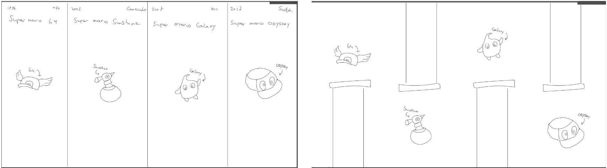
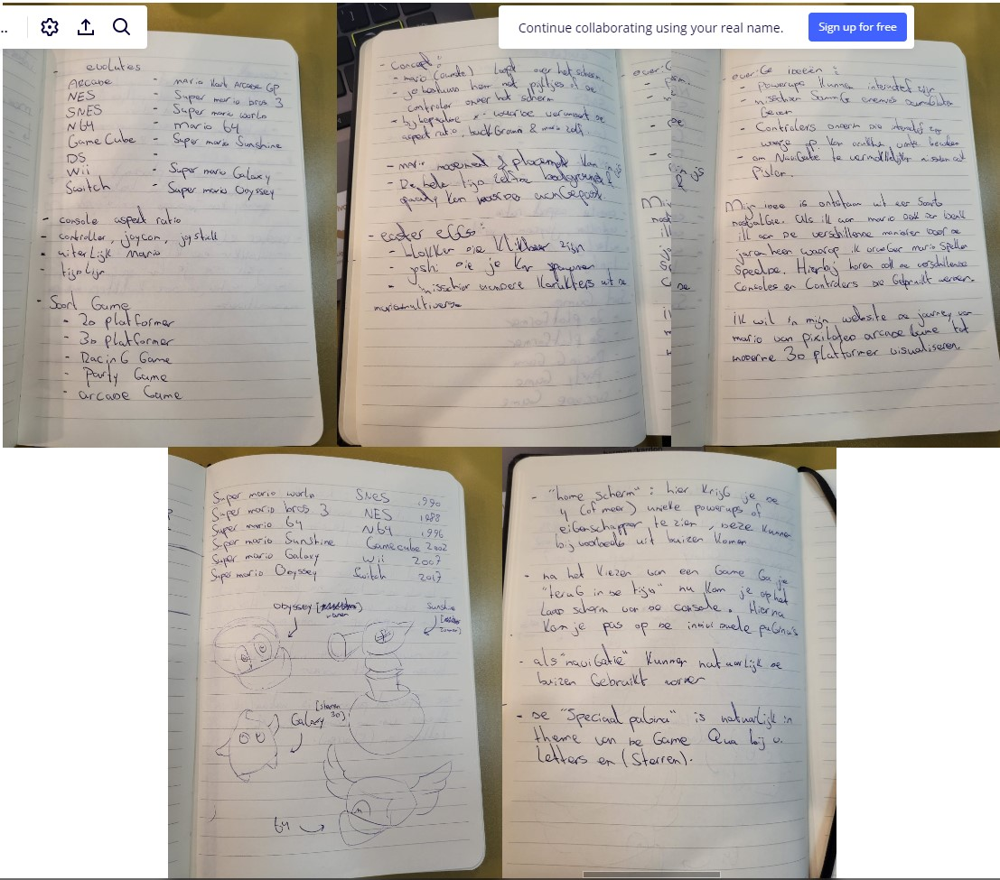
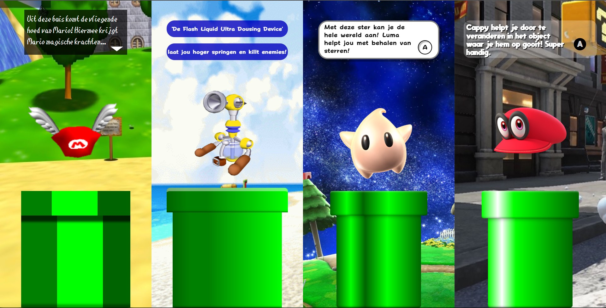
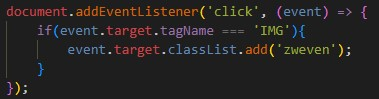
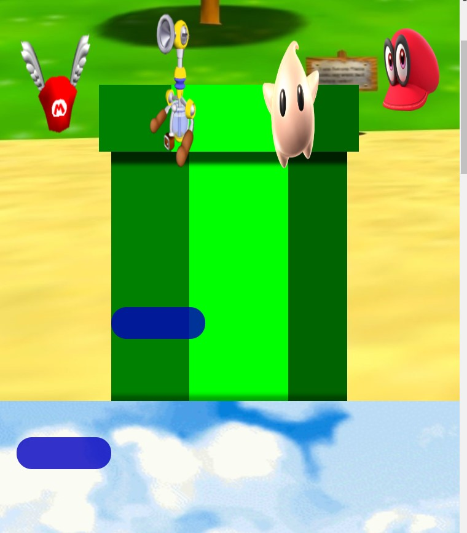
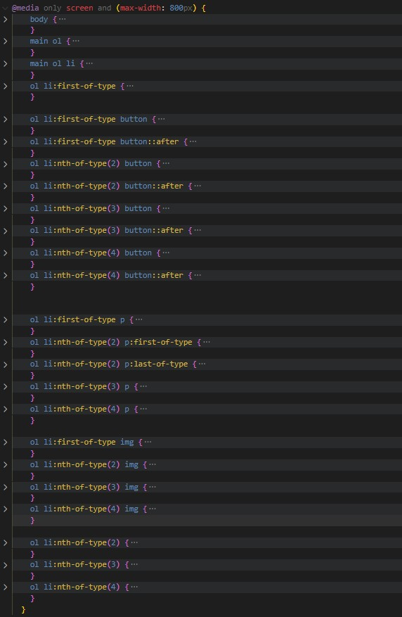

## Jij

### Ontwerper:
Rutger de Groot

#### Je startniveau:
Rood

# Je plan

  
De eerste versie/schets van mijn ontwerp & mijn persoonlijke uitdagingen

  ### De eerste versie/schets:
  
  

  ### Je ambitie: 
  Aan deze technieken/punten wil ik werken:
  - Ik wil CSS kunnen toepassen op een creatieve manier in plaats van alleen het kunnen maken van een website wat ik al redelijk goed kan.
  - Daarnaast wil ik mijn vaardigheden met JavaScript verbeteren. Ik weet nog niet heel veel van JS af en het lijkt mij leuk om te leren hoe ik dit kan combineren met HTML en CSS.
  - Omdat het gebruik van divs, navs, classes en id's niet toegestaan wil ik me meer gaan verdiepen in hoe ik mijn html en css zo efficient mogelijk in elkaar kan zetten.

## Voortgang/Feedback 1

  

    Bevindingen uit het eerste feedbackmoment. Sessie heb ik uitgevoert met Vita. Op 1 november 2022.
  

  ### Bevinding 1:
  Gebruik geen aparte pagina's om de gebruiker van informatie te voorzien

  #### oplossing:
  Ik ga dit oplossen door geen aparte pagina's te gebruiken maar misschien popups die over het scherm heengaan waar ik informatie op kan doen.

  ### Bevinding 2:
  Mijn eerste schets lijkt een beetje te veel op een echte tijdlijn omdat het vier vakken met alleen een powerup zijn en een datum van de release van de game.

  #### oplossing:
  Probeer meer (net zoals bij de tweede schets) spelelementen zoals de buizen toe te voegen die de tijdlijn duidelijk maken ipv letterlijk de datum te benoemen.

  ### Bevinding 3:
  Bedenk wat kenmerkent was voor die games en laat dit duidelijker terugkomen. Niet alleen de buizen en pixelated/ goede kwaliteit van de games.

  #### oplossing:
  Ik ga de tekst en tekstboxes uit de games namaken met CSS en hierin de informatie doen ipv op een aparte pagina. Hiermee heb ik niet alleen een betere navigatie en informatieverdeling maar ook een herkenbaar element voor die game.

  ### Bevinding 4:
  Om wat meer interactie te hebben kan je nog een soort game maken waarbij je bijvoorbeeld iemand (een prinses) moet redden...

  #### oplossing:
  Om uiteindelijk een minder statisch beeld te krijgen en meer interactie te creeëren voor de gebruiker ga ik misschien de powerups uit de buis laten komen in combinatie met een interactie. Bijvoorbeeld een click of hover.

  ### Bevinding 5:
  Voor verdere 'Easter eggs' kan je ook andere Mario personages toevoegen zoals Joshi of meerdere blokken die klikbaar zijn.

  #### oplossing:
  Ik heb gekeken naar meerdere soorten easter eggs om toe te voegen maar ik vind het moeilijk om nog veel andere elementen toe te voegen op de pagina omdat ik bang ben dat alle 4 de delen van het scherm dan echt veel te vol komen te zitten.

## Voortgang/Feedback 2

  

    Bevindingen uit het tweede feedbackmoment. Sessie heb ik uitgevoert met Nathan. Op 7 november 2022.
  

  
  ### Bevinding 1:
  Er is nog geen gebruik gemaakt van backup fonts dus wanneer het custom font om een of andere rede niet werkt valt de website terug op het systeemfont.

  #### oplossing:
  Ik ga backup fonts toevoegen waardoor er in ieder geval een redelijk font is wanneer de andere het niet doet in plaats van een font dat totaal niet bij de sfeer van de website past.

  ### Bevinding 2:
  Naast het veranderen van de cursor is er nog niet veel gebruik gemaakt van de verschillende states van CSS om duidelijk te maken dat er geklikt kan worden.  

  #### oplossing:
  Ik kan nog een aantal hovers toevoegen op de divs van de buizen. Bijvoorbeeld door de buis donkerder te maken of juist lichter waardoor je weet dat er iets kan gaan gebeuren. Hetzelfde geldt voor de tekstboxen die aan het begin leeg zijn. Hier kan ik bijvoorbeeld ook een hover op toevoegen, misschien dat dan bij de eerste en laatste twee de pijl en A-knop gaan knipperen bijvoorbeeld.

  ### Bevinding 3:
  Er is geen commentaar in mijn HTML of CSS en ook minimale comments bij mijn JS.

  #### oplossing:
  Voeg dit nog even toe. Vooral in de CSS en JS is dit toch echt wel handig zodat je weet waar alles staat en zodat je het makkelijk terug kunt vinden. Vooral als alles dichtgeklapt staat. Sorteer deze secties dan ook.

  ### Bevinding 4:
  Sommige code wordt onnodig meerdere keren geschreven. Als alle listitems een flexbox moeten worden dan kan je dat gewoon één keer schrijven in plaats van dit bij alle losse selectoren benoemen.

  #### oplossing:
  Dit heb ik op meerdere plekken volgens mij nog niet optimaal gedaan dus ik ga het aan het einde nog even nakijken omdat het wel echt veel lijnen code scheelt.

  ### Bevinding 5:
  website is niet te besturen met de tab omdat er geen interactieve elementen zijn (zoals buttons). Dit is niet heel handig. De tekstboxes daarentegen zouden wel bestuurd kunnen worden met de pijltjes zoals bij punt 2 benoemd wordt.

  #### oplossing:
  Maak van de buizen die nu een div zijn een button. Als het goed is zou deze dan met tab bedient kunnen worden.

## Voortgang/Feedback 3

  

    Bevindingen uit het derde feedbackmoment. Feedbacksessie is uitgevoerd op 9 novembeer 2022 met Emy.
  

  
  ### Bevinding 1:
  Op het moment gebruik je een class voor de animatie omdat dit korter is om aan te geven in css. Je kan dit vermijden door een langere selector te gebruiken.

  #### oplossing:
  Ik heb de class weggehaald en in de plaats een de selector 'ol li button' gebruikt. Dit is veel minder lang dan ik had verwacht omdat ik dacht dat alle buttons los benoemd moesten worden terwijl je dit gewoon op een algemene manier kan benoemen.

  ### Bevinding 2:
  Gebruik comments om de structuur van je CSS duidelijker te maken. Vertel wat waar staat en gebruik een logische volgorde.

  #### oplossing:
  Door gebruik te maken van grote comments heb ik onderscheid gemaakt tussen de CSS secties. Zo ben ik begonnen met het importeren van de fonts, daarna de css reset, custom properties, algemene stijling (main), daarna het benoemen van de animatie voor de images, daarna alle animaties die keyframes gebruiken en ten slotte media queries.

  ### Bevinding 3:
  Gebruik comments om moeilijke codde uit te leggen. Hierdoor weten mensen wat een moeilijk stuk of heel lang stuk code doet. De leraar weet dan ook dat je het snapt.

  #### oplossing:
  Ik heb met gebruik van comments aangegeven wat sommige code doet omdat deze delen wellicht niet helemaal duidelijk zijn voor iemand die de code voor het eerst leest.

  ### Bevinding 4:
  Het is lastig/ eigenlijk niet goed te zien wat klikbaar is en wat niet. Probeer misschien stated te gebruiken om de verschillende mogelijkheden van interacties op je pagina duidelijk te communiceren met de gebruiker.

  #### oplossing:
  Ik was het hiermee eens, het is inderdaad niet goed te zien dat bijvoorbeeld de buizen klikbaar zijn. Mijn oplossing hiervoor was dat ik een hover en een focus state heb toegevoegd waarbij je door meerdere kleine animaties kunt zien dat er een interactie mogelijk is. Ik heb bijvoorbeeld een grotere shadow op de eerste en de gradient die van kleur verandert bij de andere.

  ### Bevinding 5:
  Geef duidelijk aan wat je concept is, het is aan het begin niet helemaal duidelijk waar de tijdlijn over gaat.

  #### oplossing:
  Ik denk zelf niet dat dit zo'n groot probleem is omdat het naar mijn mening best duidelijk te zien is aan de buizen en algemene kwaliteit van de background images dat het gaat over de evaluatie van de mario games over de tijd heen.

## Reflectie

  
Mijn eindresultaat & persoonlijke ontwikkeling

  ### Je uitkomst - karakteristiek screenshot(s):
  

  ### Dit ging goed/Heb ik geleerd:
  Als ik terugkijk naar mijn leerdoelen aan het begin van het vak dan denk ik dat ik wel veel voortgang heb gemaakt. Door CSS toe te passen in een andere context (geen website) heb ik dingen gedaan die ik niet wist konden of heel onpractisch leken. Een voorbeeld hiervan is het gebruiken van een 'ol'. Voorheen dacht ik dat lists alleen gebruikt werden voor letterlijke lijsten van tekst op een pagina. Echter snap ik nu dat lists voor veel meer dingen gebruikt kunnen worden, bijvoorbeeld om een hele flexbox met items te huisvesten.

  Naast dit soort praktische dingen heb ik ook veel geleerd over mogelijkheden binnen CSS. Het gebruiken van custon properties had mij in het verleden veel moeite kunnen besparen en neem ik zeker mee. Ook snap ik nu hoe ik darkmode makkelijk kan toevoegen aan een website en hoe ik makkelijk animaties kan maken met keyframes.

  Wat JavaScript betreft heb ik echt heel veel vooruitgang gemaakt. Ik was al een beetje bekend met de structuur van de taal maar wat je nou precies kon doen wist ik nog niet. Ik hem inmiddels geleerd hoe ik onclick events kan maken en hoe ik door middel van if statements en counters ook animaties kan maken binnen JS.
  
  Wat er eigenlijk gebeurt is dat er een op een click op de pagina een functie zich afspeelt. In de fucntie zit een if statement die alleen aanslaat wanneer de target een IMG is. Wanneer dat gebeurt geef je deze 'target' een class mee. Vervolgens kan je in deze class in CSS de animatie laten afspelen.

  ### Dit was lastig/Is niet gelukt:
  Iets dat mij helaas niet is gelukt mmaar wat ik wel heel graag wilde doen is het compleet responsive maken van mijn website. Voor grotere schermen is de website goed te gebruiken, gelukkig want dat was ook de opdracht. Voor mobiele schermen werkt de website jammer genoeg niet.
  Ik heb geprobeert om de website ook voor mobile te maken door een media query toe te voegen. onderin de CSS. Wanneer het scherm een een width krijgt van minder dan 800px laat ik de flexbox wrappen en geef ik de children een width van 100vw zodat elke listitem fullscreen gaat. De buizen krijgen dan ook een nieuwe width en height zodat ze het scherm meer vullen.
  Het probleem is alleen dat de tekstbox van het tweede item niet goed naar het midden gaat en dat de powerups die nu met viewport nogsteeds op dezelfde plek bovenaan op het scherm terecht kwamen. Dit heb ik op moeten lossen door de viewport in de animatie aan te passen.
  
  

## Bronnenlijst

  
continu bijhouden terwijl je werkt

  Nb. Wees specifiek ('css-tricks' als bron is bijv. niet specifiek genoeg).

  ### Images
  1. Image voor Mario 64 powerup
  https://www.mariowiki.com/Wing_Cap

  2. Image voor Mario Sunshine powerup
  https://www.mariowiki.com/F.L.U.D.D. 

  3. Image voor Mario Galaxy powerup
  https://mario.fandom.com/wiki/Luma_(character) 

  4. Image voor Mario Odyssey powerup
  https://comicbook.com/gaming/news/cappy-kills-mario-super-mario-odyssey-nintendo-switch/ 

  ### Background Images
  5. Background-image voor Mario 64
  https://www.gameinformer.com/b/features/archive/2011/10/15/replay-mario-64.aspx

  6. Background-image voor Mario Sunshine
  https://www.reddit.com/r/supermariosunshine/comments/im0n9i/looks_like_this_gelato_beach_background_is/

  7. Background-image voor Mario Galaxy
  https://www.mariowiki.com/Mario_Galaxy_(stage)

  8. Background-image voor Mario Odyssey
  https://www.vg247.com/dropping-mario-into-a-normal-environment-like-new-donk-city-in-super-mario-odyssey-had-miyamoto-worried

  ### Gebruikte bronnen voor code (die ik wel zelf snap)
  9. typewriter effect voor de textboxes
  https://www.w3schools.com/howto/tryit.asp?filename=tryhow_js_typewriter 
  10. codepen die Sanne heeft gemaakt, heb ik toegepast op alle buizen en wel zelf ook verandert
  https://codepen.io/rutgerjohan/pen/oNyxgyE 

  ### Sounds
  11. Mario galaxy sound effect
  https://www.youtube.com/watch?v=VyPy3ALUwss

  12. Mario odyssey sound effect
  https://www.youtube.com/watch?v=0LU7WwPVU50 

